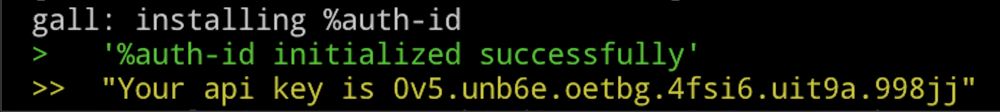
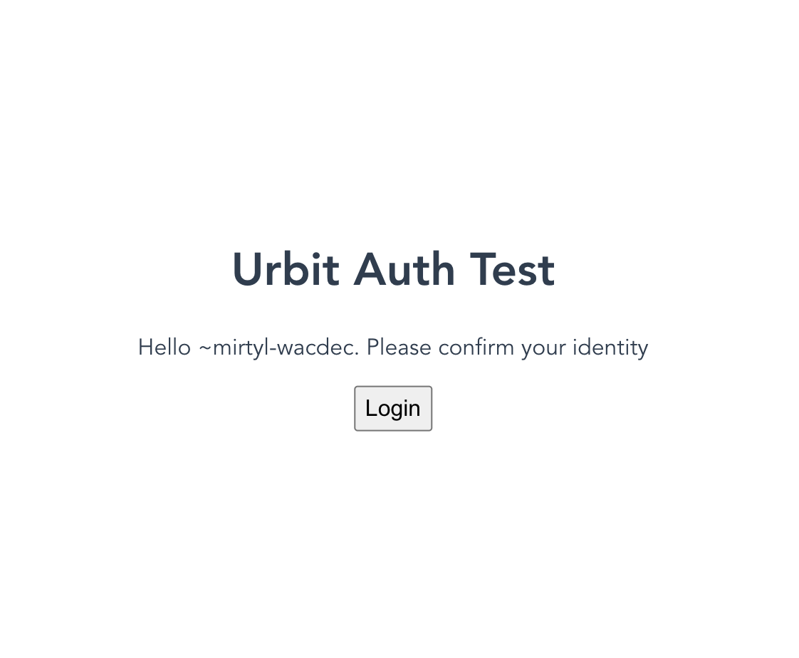

# Introducing Urbit auth-id

## Web2 And It's Paperwork

Everyone these days uses many different software services for our daily needs. Email, social media, note-taking, schedule management, project management, food delivery, online shopping. Odds are the average person reading this piece uses dozens of SaaS (Software as a Service) platforms in a weekly basis. And for good reason, good software makes our lives better.

They all start the same way. You visit their website, and you _register_. You must fill in a form with your personal information. Some services demand more than others. Almost all of them will ask for an email address and a name. Increasingly they also demand your phone number too. On top of that you also have all those passwords to remember, each which should be unique, and have a variety of letters, numbers, symbols, and be long, but not too long. Besides the privacy issues with giving your private information to so many different companies (with high odds an eventual leak will occur), aren't we all just tired of filling so many forms?

The internet wasn't supposed to become this Kafkian world where we are constantly filling in forms, again and again, to access new services. How much time do we waste every day just logging in to websites? Doesn't my computer already know it's me?

The need for a unified, common standard of identity for the internet was identified long ago, and some approaches have come close to it, such as oAuth. Some of you may already use "login with Google" or "login with Facebook", which are certainly convenient compared to registration form hell. But surely depending on Facebook to identify yourself to your schedule management software is not how authentication should work. It's your identity, you should have complete control over it.

## Urbit ID

Luckily we have an existing solution to take advantage of, with Urbit ID. Urbit IDs are your cryptographic property. They are non-fungible tokens deployed on the Ethereum blockchain using the ERC-721 standard. In fact they are one of the oldest NFTs ever deployed. [You can read more details here](https://urbit.org/docs/azimuth/azimuth) on the Urbit ID system and how it relates to Urbit OS, but in short, you must own an Urbit ID in order to access the Urbit network. Urbit IDs are finite in number (2^32 sovereign IDs), so spam protection (aka Sybil resistance) is built-in to the system.

If you have an Urbit ID, most likely you already run an Urbit server. You enjoy private messaging, publishing, and an increasingly rich ecosystem of decentralized apps, all run by yourself. Thanks to Urbit Visor you can now interact with traditional websites using data from your Urbit ship, disclosed by you exactly how you want it thanks to it's built-in permission system. There is only one missing piece: logging in.

## auth-id

With the introduction of `auth-id`, an Urbit backend application (i.e. a Gall agent), you can securely and easily login to external websites with a single click. No more filling in forms, no more forgetting your password. All users will need to do is install Urbit Visor in their browsers, and they can prove their identity at the single click of a button. For environments where Urbit Visor is not available, `auth-id` will also work, but users will need to manually validate their login in a similar way as receiving an OTP through SMS for smartphone apps.

If you're excited by the possibilities, and you very well should be, in the following sections we will be diving deep into how developers can use `auth-id` to authenticate users in their services.

## How To Authenticate Users With Urbit ID

`auth-id` is an Urbit Gall agent, a piece of software running on your Urbit ship. Developers will need to run an Urbit server which will be in charge of authenticating users to their application. Think of it as an authenticating microservice, just much, much easier to set up.

### Installation

First of all go to your Urbit terminal, either `dojo` or the web terminal interface, and run the following command to install the agent:

`|install ~dister-dozzod-havbex %auth-id`

After a short period, you will have the agent installed on your ship. The following message will be printed at the terminal:



Write down the API key, you will need it to secure your requests to the agent. You can change it or print it later at any time. To do so, go to the ship's dojo (or web terminal), and run one of these commands:

```hoon
:auth-id %cycle-key
```
to change the api key (the new one will be printed at the terminal)

```hoon
:auth-id %print-key
```
to print the api key in the terminal.

### Test app

That is all you need to do on the Urbit side of things. We will now make a very simple web application to show how to use the agent to authenticate users. We will be doing a simple static website, which will prompt users to login, then save and display a count of how many times the user has logged in. We'll make a simple React application with an express server to interact with a simple JSON database.

This is all of course just for demonstration purposes. You can use `auth-id` with any framework or platform of your choice, both frontend and backend. All you need to be able to do is send HTTP requests to your Urbit ship. Everything else is up to the developer.

Let's start our application. As in previous guides, we will be using `vite` to build our application.

```bash
npm create vite@latest
```

We will choose the `react-ts` template, but you can use whatever you're comfortable with.

Now go to the directory of your app. You will see the scaffold of a React app. Let's modify `App.tsx` and write our simple login app.

```tsx
import { useState, useEffect } from "react";
import { urbitVisor } from "@dcspark/uv-core";
import "./App.css";
function App() {
  useEffect(() => {
    urbitVisor.require(["shipName", "auth"], setData);
  }, []);
  function setData() {
    urbitVisor.getShip().then((res) => {
      setShipname("~" + res.response);
      setMessage(`Hello ~${res.response}. Please confirm your identity`);
    });
  }
  const [shipName, setShipname] = useState("");
  const [message, setMessage] = useState("");
  const [classname, setClassname] = useState("");
  const [buttonString, setButtonString] = useState("Login");
  const [buttonDisabled, setButtonDisabled] = useState(false);
  function callServer() {}

  return (
    <div className="App">
      <h1>Urbit Auth Test</h1>
      <p className={classname}>{message}</p>
      <button disabled={buttonDisabled} type="button" onClick={callServer}>
        {buttonString}
      </button>
    </div>
  );
}
```

Let's style it a bit, modifying `App.css`:

```css
.body {
  position: relative;
}
.App {
  font-family: Avenir, Helvetica, Arial, sans-serif;
  -webkit-font-smoothing: antialiased;
  -moz-osx-font-smoothing: grayscale;
  text-align: center;
  color: #2c3e50;
  position: absolute;
  top: 50%;
  left: 50%;
  transform: translate(-50%, -50%);
}

button {
  font-size: 1rem;
  height: 2rem;
}
#count {
  color: green;
}
#error {
  color: red;
}
```

Save the files, run `npm run dev`, and go to `localhost:3000` (or whichever port `vite` gives you) in a browser. The app will ask for permissions to Urbit Visor. Grant them and then you should see our very barebones page:


The app does nothing yet, besides read the name of the ship connected to Urbit Visor. The idea here is that on clicking the Login button, it will authenticate by interacting with the `auth-id` agent we installed on our backend ship. That code will go in the `callServer()` function which is now empty.

There's two ways of doing that. We could have the frontend directly poke the `auth-id` agent, receive an authentication token and run the whole logic in the frontend. There's a few problems with that. One is that HTTP requests from a web browser are subject to [CORS](https://developer.mozilla.org/en-US/docs/Web/HTTP/CORS) restrictions. Urbit servers are equipped to deal with CORS requests, but you must whitelist them beforehand (see more details [at the official documentation](https://urbit.org/docs/arvo/eyre/guide#managing-cors-origins)).

The other, more important problem, is that the frontend is not a very secure environment. Authentication on the web is a hard problem, and login credentials should always be handled by a properly secured server, with a proper database, in order to provide better security. While handling Urbit authentication on the frontend might be sufficient for very simple apps which don't expose sensitive data, in this guide we will explain the best practices for authentication and run a backend server to handle the authentication process.

While you can run any backend server of any language of your choice, we will stick to the JavaScript ecosystem here and run a very simple Express server. In the same root folder of your React app, add the following npm packages:

```bash
npm i express node-fetch cors
```

For consistency purposes we will be using ESM syntax, the latest syntax common to both frontend and backend in JavaScript. Add also the following line to the `package.json` file:

```json
"type": "module",
```

Let's now start writing our server. It will be a very simple RESTful API.

```bash
touch server.js
```

```ts
import express from "express";
const app = express();
const port = 3333;

app.listen(port, () => {
  console.log(`Urbit Auth server running at port ${port}.`);
});
```

Now let's test that everything is alright. Run the server with

```bash
node server.js
```

You should see a simple message at your terminal, showing that your server is running at `http://localhost:3333`.

Now let's flesh it out a bit.

First we'll need a simple database to keep track of login counts. It will be a basic json file.

```bash
touch db.json
```

Add an empty object inside the file:

```json
{}
```

Save the changes, and now let's implement the authentication flow.

The flow of authentication with `auth-id` is the following.
A user wants to login to your app, and declares his Urbit ID. Let's say, for example, that he claims to be `~sampel-palnet`. Your frontend will send that request to your app backend server.

Your app server now has to make an HTTP request to your Urbit server running `auth-id`, giving it the name of the Urbit ID to authenticate. Let's write up the endpoint in our Express server to do just that.

```js
import express from "express";
import fetch from "node-fetch";
import cors from "cors";
const app = express();
app.use(express.json());
app.use(cors());
const port = 3333;

const url = "http://localhost";
const key = "0v9c7jl.ehrg6.fn4as.fj1vq.blu98";

app.listen(port, () => {
  console.log(`Urbit Auth server running at port ${port}.`);
});
app.post("/init", runAuth);

async function runAuth(req, res, next) {
  const opts = {
    method: "POST",
    body: req.body.ship,
    headers: {
      auth: key,
    },
  };
  const r = await fetch(url, opts);
  const j = await r.json();
  console.log(j, "response form urbit ship");
  if (j.token) {
    const filename = `${req.body.ship}.json`;
    fs.writeFile(filename, j.token, "utf8", (err) => {
      console.log(err, "err");
    });
    setTimeout(() => {
      fs.unlink(filename, (err) => {
        console.log(err, "deleted");
      });
    }, 30000);
    res.status(200).json({ status: "ok" });
  } else res.status(400).json(j);
}
```

Our server will be doing the request to our Urbit ship's 'auth-id' agent, so first we have to give it the URL of the ship, and the API key of the agent. We'll save those at the `url` and `key` variables. We also add some imports and middleware code to make sure our server can take POST requests and handle CORS properly.

Then we set a server endpoint at `/init`, which will listen to POST requests from the frontend, thus `app.post("init", runAuth)` in Express syntax.
POST requests to `http://localhost:3333/init` will trigger the `runAuth()` function in our server. That function takes a request `req`, a response `res`, and a `next` argument that we won't be using.

Our `runAuth` function expects POST requests with a json body with the following field:

```json
{
  "ship": "~sampel-palnet"
}
```

The function will then take that body and will do a POST request of its own to the Urbit ship, passing it the provided Urbit ship name.

That request will cause two actions by the Urbit ship running the `auth-id` agent.
First, the agent will generate an authentication token. The Urbit ship running `auth-id` will send a DM to the Urbit ship requesting authentication, i.e. your application user. Then the agent will return that same code to the HTTP request, so that your app's backend server can store it in your database and wait for the user to input that token to confirm his identity. Think of a typical email recovery flow, or an OTP sent by email or SMS.

In this example we won't be running a full scale database; we're taking it easy and storing the token in a file, with the user's ship as the filename. So if `~sampel-palnet` is trying to authenticate, our server will poke our `auth-id` agent, and store the generated authentication token as in `~sampel-palnet.json`.

We then set a timeout to delete that file after 5 minutes (30,000 miliseconds), so there is a time limit for logging in. We then return a simple payload to the frontend, a status 200 response saying `{status: "ok"}`, or a 400 response with an error message if something went wrong (e.g. the ship name was wrong) with the request to the Urbit ship.

Now let's go back to our frontend and add the code to call the server endpoint we just wrote. Let's go to `App.tsx` and flesh out the `callServer()` function:

```tsx
const serverURL = "https://localhost:3333";

async function callServer() {
  setButtonString("...");
  setButtonDisabled(true);
  const headers = new Headers();
  headers.append("Content-Type", "application/json");
  const body = JSON.stringify({
    ship: shipName,
  });
  const opts = {
    method: "POST",
    headers: headers,
    body: body,
  };
  const r = await fetch(serverURL + "/init", opts);
  const j = await r.json();
  if (j.status === "ok") {
    const res = await urbitVisor.authorizeShip("dister-dozzod-havbex");
    check(res.response);
  } else error("b");
}
function success(count: number) {
  setMessage(
    `Welcome, ${shipName}. You have logged in ${count} times already.`
  );
  setButtonString("Done");
  setButtonDisabled(true);
}
function error(m: string) {
  setClassname("error");
  if (m === "b")
    setMessage(
      "The Urbit authentication ship appears to be down, please try again later."
    );
  else if (m === "v")
    setMessage("Identity verification failed. Are you on a fake ship?");
}
```

In lieu of a loading spinner we will modify and disable the Login button once we click on it. Then we send the request to our server's `/init` POST endpoint. If there was an issue, we'll call the `error()` function, which will display an error message. If everything went well, it means we already generated an authentication token, and our Urbit authentication ship sent a DM to the user trying to login.

So what do we do now? One way of doing this is just displaying an input box and have the user manually input the authentication code they received. Again, this is similar to how email or SMS authentication works in most websites. If you are building a mobile, CLI, or any other application on a unique release target, you could very well implement an authentication flow like this, and it would work just fine.

Thankfully however, in a web environment we have the opportunity to use Urbit Visor to automate the process, so the user gets a nearly hands-free experience. 

We can use Urbit Visor's new endpoint, `authorizeShip()` to automate the authentication process. The function takes one argument, the name of the Urbit ship running `auth-id`, which will send a DM to the user with the auth code. Urbit Visor will automatically accept the DM and scry its contents in behalf of the user, and return the token it scried.

Now all we have to do is make sure that token is the same as the one sent by the `auth-id` agent to the website's backend. Let's call the `check()` function to do that.

```tsx
function check(token: string) {
  backendCheck(token).then((res) => {
    if (res.status === "ok") success(res.count);
    else error("v");
  });
}

async function backendCheck(token: string) {
  const headers = new Headers();
  headers.append("Content-Type", "application/json");
  const body = JSON.stringify({
    ship: shipName,
    token: token,
  });
  const opts = {
    method: "POST",
    headers: headers,
    body: body,
  };
  const r = await fetch(serverURL + "/check", opts);
  return await r.json();
}
```

The `backendCheck()` function will call our Express backend server API, sending a JSON payload with the ship name and the token extracted by Urbit Visor. The function is calling the `/check` endpoint, which we haven't written yet in the server, so let's go back to `server.js` and do just that.

```js
app.post("/check", check);
function check(req, res, next) {
  const filename = `${req.body.ship}.json`;
  fs.readFile(filename, "utf8", (err, data) => {
    if (data === req.body.token) {
      const count = getCount(req.body.ship);
      res.status(200).send({ status: "ok", count: count });
    } else res.status(400).send({ status: "error", error: "ng" });
  });
}
function getCount(ship) {
  const json = fs.readFileSync("./db.json", "utf8");
  const data = JSON.parse(json);
  const count = data[ship];
  if (!count) {
    const newDb = {};
    newDb[ship] = 1;
    fs.writeFile("./db.json", JSON.stringify(newDb), "utf8", (err) => {
      console.log(err, "error writing to file");
    });
    return 1;
  } else {
    data[ship] += 1;
    fs.writeFile("./db.json", JSON.stringify(data), "utf8", (err) => {
      console.log(err, "error writing to file");
    });
    return count + 1;
  }
}
```

POST requests to `/check` on our server will run the `check()` function. That function will read the `json` file created previously by `runAuth()` and see if the token passed is correct. If it's not correct, we pass a 400 response to the frontend. If correct, we then go persist that in our database, get the login count, and pass it back to the frontend in a HTTP 200 response.

Our `db.json` file will be a simple object, where ship names are the keys, and successful logins (a `number`) are the values. If the key doesn't exist, the `getCount()` function adds it to the database and returns `1`, if the key does exist we increment the value and return it.

Back in the frontend, we'll handle the responses from the `check` endpoint of our server. If authentication was successful, we'll call the `success()` function written before, which will show a success message in the page, and if not we will run `error()` to render an error message.

And that's it! Try it out, and you have a fully functional Urbit authentication server running. No more relying on external services to secure your application. While our code got more complicated than usual, juggling three elements: an Urbit server, a web frontend and a Node backend, the code for each is very simple and straightforward, which is what Urbit is all about: owning our code and infrastructure, and being able to understand it fully.

The full code for this `auth-id` as well as this demo application is public at [our Github repo](https://github.com/dcspark/urbit-visor), so please go check it out and try it by yourself. You can also reach us at our Urbit group, `havbex/dcspark` and [Discord](https://discord.gg/dcspark) for any doubts or suggestions.


#### Credits
**Author:** ~mirtyl-wacdec

**Editor:** ~mocrux-nomdep
