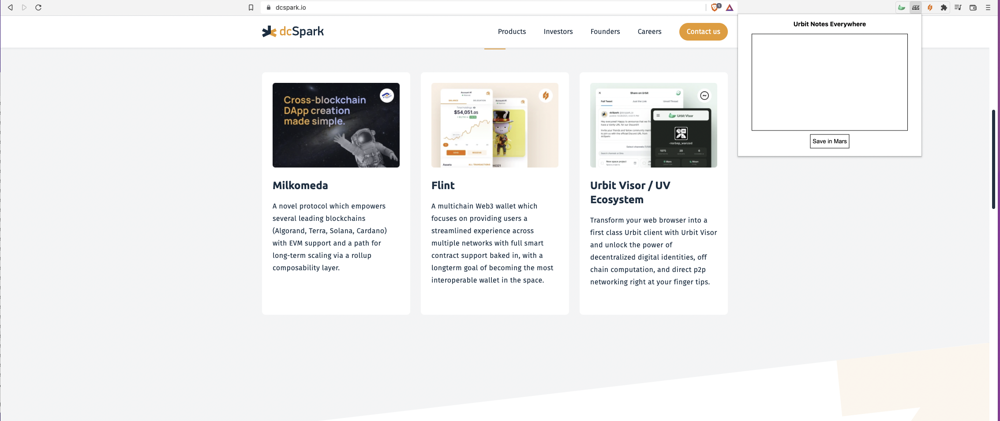
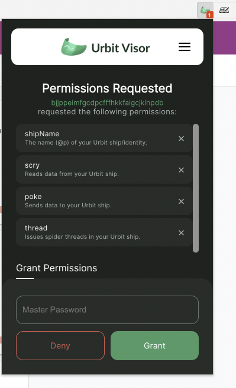
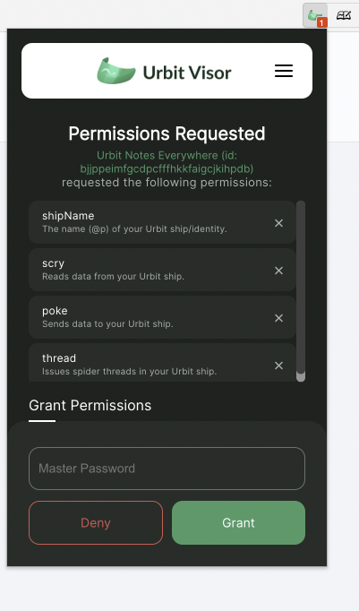

# Building UV Extensions - Developer Guide

Before jumping into this UV Extension guide, it is highly recommended that you work through the [Building Urbit Web Apps](https://github.com/dcSpark/urbit-visor/blob/main/guides/building-urbit-web-apps/README.md) developer guide first. The former guide walks you through all of the core basics for learning how to get started building on top of Urbit Visor, and thus is a pre-requisite.

This new guide will show you how to build chrome browser extensions which use Urbit Visor directly. These Urbit Visor-based browser extensions (aka. UV Extensions) enable a whole new category of user experiences compared to webapps. With webapps you are limited to a single tab inside of a web browser, thus being "stuck in a box" separated from the rest of the web experience.

UV Extensions on the other hand allow us to inject code into any websites the user visits, run background listeners in the browser to allow interaction from anywhere at any time, and thereby enable a novel Urbit-based Web3 metalayer to exist on top of the existing web. This provides users with experiences that were never possible before, as we take advantage of the interfaces of Web2 yet with all of the power of Web3 via Urbit.

For demonstration purposes we will be making a browser extension to enhance the functionality of Urbit Notes (the web app we created in the [previous guide](https://github.com/dcSpark/urbit-visor/blob/main/guides/building-urbit-web-apps/README.md)). Our new extension, which we'll call `Urbit Notes Everywhere`, will show off how to take advantage of the backend and overall design of an existing app (Urbit Notes). This UV extension will provide users with a whole new experience that exemplifies the fact that both Urbit Web Apps and the UV Extensions can share the same backend.

Urbit Notes Anywhere will allow the user to either click on the extension icon, or hit a hotkey on their keyboard, and be greeted with a UI to add new notes extremely quickly.

Without further ado, let's get to it. The [previous guide](https://github.com/dcSpark/urbit-visor/blob/main/guides/building-urbit-web-apps/README.md) already covered how to setup Urbit Visor so we will skip through that and go straight to developing the extension.

## Making an Extension Manifest

When building a browser extension you first must write a Manifest; a JSON file named `manifest.json`. Manifests can vary a bit between browsers. In our case we will be making a Chrome extension, and since 2022 all Chrome extensions must follow the [Manifest V3](https://developer.chrome.com/docs/extensions/mv3/intro/) specification.

Let's make a new folder to house our code

```bash
mkdir urbit-notes-ext
```

Let's make two folders: `src` for the source code, and `dist` for the built code to be read by the browser.

```bash
cd urbit-notes-ext
mkdir src
mkdir dist
```

Let's make a manifest file and place it inside the `dist` subfolder.

```bash
cd dist
touch manifest.json
```

In the `manifest.json` file, we'll be adding this base structure:

```json
{
  "name": "Urbit Notes Everywhere",
  "version": "0.1.0",
  "description": "Browser Extension to take Urbit Notes everywhere on the Web",
  "manifest_version": 3,
  "icons": {
    "16": "./icons/icon16.png",
    "48": "./icons/icon48.png",
    "128": "./icons/icon128.png"
  },
  "content_scripts": [
    {
      "matches": ["*://*/*"],
      "js": ["content.js"]
    }
  ],
  "action": {
    "default_icons": {
      "16": "./icons/icon16.png",
      "48": "./icons/icon48.png",
      "128": "./icons/icon128.png"
    },
    "default_popup": "./popup.html",
    "default_title": "Urbit Notes Everywhere"
  },
  "host_permissions": ["*://*/*"],
  "web_accessible_resources": [
    {
      "resources": ["iframe.html"],
      "matches": ["<all_urls>"]
    }
  ]
}
```

A detailed explanation on Chrome extension manifest files is beyond the scope of this guide, for more details you can visit the [official documentation website](https://developer.chrome.com/docs/extensions/) by Google.

The code above will inject the javascript code in `content.js` on all websites that match the pattern `"*://*/*"`, i.e. every website. The extension icon will be taken from `./icons/`, which holds the same icon in three different sizes. When a user clicks on the extension icon in their browser it will open a popup displaying the contents of the `./popup.html` file.

We will be sandboxing our code inside of an iframe, the source of which will be written in `iframe.html`. As such we must specify that in the manifest and expose it in `web_accessible_resources`.

Thus based off of our `manifest.json` we can see that we must create and fill three files:

- `content.js`
- `iframe.html`
- `popup.html`

Let's get to it.

## Getting Started

As in the case with Urbit Visor-powered web apps, chrome extensions using Urbit Visor will need to import the `uv-core` library. Our frontend will be much simpler than the Urbit Notes webapp however, so we won't be needing `create-react-app` and it's associated tooling. We will simply use `npm` to manage our single dependency, and `esbuild` to build our JavaScript.

To get started, first initialize npm:

```bash
npm init
```

Then install esbuild:

```bash
npm i esbuild
```

`esbuild` has TypeScript support built in, and at dcSpark we are big fans of static typing, so we will be writing our code inside of two TypeScript files `src/content.ts` and `src/popup.ts`. They will be compiled using `esbuild`.

There are various ways of using `esbuild` to build our code. As our extension is going to be quite simple, we will add some basic `esbuild` CLI commands to the `scripts` key of our `package.json` file.

```json
  "scripts": {
    "build": "esbuild src/content.ts --outfile=dist/content.js && esbuild src/popup.ts --outfile=dist/popup.js --bundle",
  }
```

`npm run start` will give us hot reload for development, while `npm run build` will just build the file once.

Now let's install the Urbit Visor core library, the only dependency we are going to need.

```bash
npm i @dcspark/uv-core
```

Next we'll create our TypeScript files.

```bash
touch src/content.ts
touch src/popup.ts
```

And our html files (for the popup and iframe).

```bash
touch dist/popup.html
touch dist/iframe.html
```

Lastly, we can run build to generate the Javascript files:

```bash
npm run build
```

Now that our extension is compiled, we can install in our browser. Go to `chrome://extensions`, enable "Developer Mode", click on "Load unpacked", and then open the `dist` folder.

Work through any error message that may pop up if you missed a step in the process (don't forget to put those icons!) and once everything is in order the extension will be present in the extension list.

You will be able to see the extension icon in your browser extension toolbar in the top-right. Notice if you click on the extension icon... nothing happens. Of course we still have to build the extension itself in the following sections.

## Basic Concepts

As of the latest specification used by Chrome, browser extensions are made of a _content script_, a _service worker_ and a _popup page_. All of these are optional, your extension can have one, two or all of them, depending on how complex it will be.

The _popup page_ is the little UI that shows up when you click on the icon of a browser extension in your browser UI. That's actually just an HTML page, whose path we gave to the `manifest.json` file as `default_popup`.

The _content script_ is a JavaScript file which will be injected inside of websites which are visited by the browser. You can put anything in a content script, from a couple lines of code to a full-fledged React application (as [Twitter UV](https://github.com/dcSpark/twitter-uv) does).

Depending on the complexity of your content script you will need to resort to different build tools. This choice is entirely up to the developer, where Chrome only requires that the end result is built into a single JavaScript file which will be injected.

The _service worker_ is a background process run by the browser, where you can add event listeners and then do IO operations such as persist data to disk (to the browser `localStorage`), do external requests, or other computation.

To kick things off we'll start building the popup page, which will enable users to write quick notes to their `Urbit Notes` notebook without having to use the `Urbit Notes` web app.

## Popup page

### HTML

As we mentioned, a browser extension popup page is just a simple HTML website. You can do anything with it, from a simple static page (as Twitter UV does) to a full React application (like Urbit Visor). Urbit Notes Everywhere will be something in between; it'll be a simple, single-view website with some vanilla JavaScript in it.

Let's add the HTML:

```html
<!DOCTYPE html>
<html lang="en">
  <head>
    <meta charset="UTF-8" />
    <meta http-equiv="X-UA-Compatible" content="IE=edge" />
    <meta name="viewport" content="width=device-width, initial-scale=1.0" />
    <title>Urbit Visor Notes Everywhere</title>
  </head>
  <body>
    <div id="popup">
      <h3>Urbit Notes Everywhere</h3>
      <textarea></textarea>
      <button id="button">Save in Mars</button>
    </div>
    <script src="popup.js"></script>
  </body>
  <style>
    #popup {
      width: 400px;
      height: 300px;
    }
    h3 {
      text-align: center;
    }
    textarea {
      outline: none;
      background-color: white;
      border: 1px solid black;
      resize: none;
      width: 80%;
      height: 62%;
      display: block;
      margin: auto;
      padding: 1rem;
    }
    button {
      background-color: white;
      border: 1px solid black;
      height: 2rem;
      display: block;
      margin: 0.5rem auto;
      padding: 0.3rem;
    }
  </style>
</html>
```

As you see it's a rather simple website. There's one div, containing one header string, one textarea, and one button. There's also one `script` tag, sourcing the JavaScript inside `popup.js`. Paste the above code inside `dist/popup.html` and save the file. Navigate to `chrome://extensions`, and click on the refresh icon inside our extension.

Now click on the extension icon and you should see our beautiful markup:



This does nothing yet, because the `popup.js` is empty. We need to make sure something happens when we click on the "Save in Mars" button.

### JavaScript

We will start writing the logic of the extension in the `popup.ts`. All we want to do is post notes to our Notebook, so in essence this is the same logic we wrote in the Urbit Notes webapp, but even simpler. We will be reusing much of that code.

First import Urbit Visor:

```ts
import { urbitVisor } from "@dcspark/uv-core";
```

This app needs to be able to post notes on `graph-store`; meaning it must be able to `poke` the users Urbit server. `graph-store` nodes need the users ship name in order to poke, however, so we will need to fetch the user's `shipName` too.  We also want to check if the Urbit Notes channel has been created already, and if not we'll want to offer the option to create one in the extension, so that's a `scry` and a `thread` the user's Urbit Visor will have to do. So let's ask for permissions for that upfront. We'll start slowly and first just save the ship name in our script.

Let's ask for permissions for these now upfront.

```ts
let myShip = "";
function initiateVisor() {
  urbitVisor.require(["shipName", "scry", "poke", "thread"], setData);
}
function setData() {
  urbitVisor.getShip().then((res) => (myShip = res.response));
}
initiateVisor();
```

That should do it. You can now build the JavaScript:

```bash
npm run build
```

Reload the extension at `chrome://extensions`, and click on the extension icon to open the popup. You should see a prompt for granting Permissions in your Visor.



You'll see something is a bit odd, though. Urbit Visor stores permissions by domain, so if you are using Urbit Dashboard you will see that your ship has given permissions to `https://urbitdashboard.com`.

Browser extensions however, don't have a domain name; they only have a base64 string UID. This string works well to identify extensions programatically, but we can't expect our users to remember that, e.g. Twitter UV Extension ID is `dfidmeghmgfhhflhfopoeinniomenjlf`. To improve the user experience, Urbit Visor lets developers `register` a name for their extension so your users know what they have given permission to.

Let's decline the permissions first, and go back to `popup.ts` to add that. We'll modify the `initiateVisor()` function:

```ts
function initiateVisor() {
  urbitVisor.registerName("Urbit Notes Everywhere");
  urbitVisor.require(["shipName", "poke"], setData);
}
```

Again, build, reload, and click on the icon.



Much better.

Now let's add the rest of the logic. We'll copy the logic from the Urbit Notes webapp to build notebook posts from a string, slightly modified.

```ts
function makeIndex() {
  const DA_UNIX_EPOCH = BigInt("170141184475152167957503069145530368000");
  const DA_SECOND = BigInt("18446744073709551616");
  const timeSinceEpoch = (BigInt(Date.now()) * DA_SECOND) / BigInt(1000);
  return "/" + (DA_UNIX_EPOCH + timeSinceEpoch).toString();
}
function buildPost(index: string, contents = []) {
  return {
    author: "~" + myShip,
    contents: contents,
    hash: null,
    index: index,
    signatures: [],
    "time-sent": Date.now(),
  };
}
function addNotebookPost(title: string, text: string) {
  const index = makeIndex();
  const contents = [{ text: title }, { text: text }];
  const children = {
    "1": {
      post: buildPost(`${index}/1`),
      children: {
        "1": {
          children: null,
          post: buildPost(`${index}/1/1`, contents),
        },
      },
    },
    "2": {
      post: buildPost(`${index}/2`),
      children: null,
    },
  };
  const nodes = {};
  nodes[index] = {
    children: children,
    post: buildPost(index),
  };
  const body = {
    "add-nodes": {
      resource: { name: "my-urbit-notes", ship: `~${myShip}` },
      nodes: nodes,
    },
  };
  return body;
}
```

We are changing here the logic for new posts a bit. The Urbit Notes webapp generated indexes for new posts by incrementing the last existing index; doing the same here would add some needless overhead (we aren't listing existing posts anyway), so we will generate the indexes from scratch, using a function provided by the built-in Urbit Groups app (open sourced by the good people at Tlon).

Note: `graph-store` notebooks take both a title string and text body. To make our UI simpler we decided to have only one single textarea as input. As such we will be extracting the title from the text body. We'll make it so that the first line (up to a reasonable length of 50 characters) gets extracted as the title, and the rest becomes the text.

```ts
function extractText(): [string, string] {
  const text = (<HTMLInputElement>(
    document.querySelector("#urbit-visor-notes-everywhere-popup textarea")
  )).value;
  const title = text.split("\n")[0].substring(0, 50);
  const rest = text.replace(title, " ");
  return [title, rest];
}
```

We now have the logic set to build the necessary data structures to _poke_ the user's Urbit server.

Let's finally add the function so that a click on the button sends the data to the user's Urbit ship. We'll handle the response and display a confirmation message inside the button (to keep this as minimal and easy to implement as possible for the educational sake). If successful, the popup will close automatically after a 2 second delay.

```ts
function saveNote() {
  const [title, text] = extractText();
  const body = buildNotebookPost(title, text);
  urbitVisor
    .poke({ app: "graph-store", mark: "graph-update-3", json: body })
    .then((res) => {
      button.disabled = true;
      if (res.status === "ok") (button.innerText = "OK"), close();
      else button.innerText = "Error";
    });
}
function close() {
  setTimeout(() => {
    window.close();
  }, 2000);
}
const button = document.querySelector("button");
button.addEventListener("click", saveNote);
```

And that's it, the logic is done. Build the app, reload the extension, and try it out by clicking on the extension icon. Voilà, our extension is working.

### Content Script

Are we done? Well, we could cut it there if all that we're building is a popup-based extension. However, we have further ambitions with Urbit Notes Everywhere. Remember we also want to allow the user to trigger a keyboard shortcut while on any page, thereby showing a modal window _inside of the page_ and enable users to write a quick note to send to their Urbit server.

The injected window itself can share most (if not all) of the markup with our popup page, and all of the JavaScript logic. We primarily need to make a few simple styling adjustments and add the injection logic in our _content script_.

Let's first go to `content.ts` and add the injection logic.

### Content Script Security

Before jumping straight in, there is one important caveat we must address that every UV extension developer should be aware of.

_Content Scripts_ inject JavaScript code into any webpage. You can also use DOM APIs to inject DOM elements into any website. That's how [Twitter UV](https://github.com/dcSpark/twitter-uv) injects urbit buttons into Twitter.com for example.

However there is a problem you need to be aware of when naively injecting JavaScript into websites from an extension _content script_. All JavaScript in a content script is injected _as is_ into the website the user is browsing. This means that the host website the user is on has access to that data/code. All of your functions and global variables are accessible to the JavaScript in that host website.

That being the case, the vast majority of websites don't check for extensions and whether they will inject code at any point in time. However, there are bad actors who can build websites which check if the user has a given extension installed which injects code/data in a predefined format, and thereby attempt to read all of it. Furthermore the website can start using the functions which are also injected and start performing actions on the user's ship without the user's permission.

This obviously has disastrous implications, and as such we are providing this warning to you up front about naively injecting user data and functions which interact with users' Urbit ships. UV Extensions should follow the highest standards of security in order to protect their users.

Browser extensions have a good way of isolating any code from the host websites they are injected to; **iframes**.

An iframe is basically a sandboxed website injected into another website. If you have ever seen an embedded Twitter.com tweet or a YouTube video, those are displayed inside iframes. iframes don't have access to website that hosts them, and most importantly for us, the host website doesn't have access to the code in the iframes.

As such, we will be injecting our content script as an iframe into every website that the user navigates to.

```ts
function createFrame() {
  const el = document.createElement("iframe");
  el.id = "urbit-visor-notes-everywhere-popup";
  const url = chrome.runtime.getURL("iframe.html");
  el.src = url;
  el.style.cssText = "height:100vh;width:100vw;position:fixed;top:0;left:0;";
  return el;
}
const frame = createFrame();
document.body.appendChild(frame);
```

This code will insert an iframe into every website the user goes to (stylized according to the CSS string). The source of the iframe will be our `iframe.html` page, and we get the full URL using the `chrome.runtime.getURL()` function, so we don't need to deal with extension ids.

`iframe.html` is pretty much exactly the same as our `popup.html` page, including it's JavaScript code (which is what calls Urbit Visor). In this case, we simply have some slightly altered CSS so that the modal shows up centered on the screen.

```html
<!DOCTYPE html>
<html lang="en">
  <head>
    <meta charset="UTF-8" />
    <meta http-equiv="X-UA-Compatible" content="IE=edge" />
    <meta name="viewport" content="width=device-width, initial-scale=1.0" />
    <title>Urbit Visor Notes Everywhere</title>
  </head>
  <body>
    <div id="background">
      <div id="popup">
        <textarea></textarea>
        <button id="button">Save in Mars</button>
      </div>
    </div>
    <script src="popup.js"></script>
  </body>
  <style>
    #background {
      position: fixed;
      top: 0;
      left: 0;
      height: 100vh;
      width: 100vw;
      background-color: rgb(0, 0, 0, 0.8);
      z-index: 45000;
    }
    #popup {
      position: fixed;
      top: 50%;
      left: 50%;
      transform: translate(-50%, -50%);
      z-index: 50000;
      width: 400px;
      height: 300px;
    }
    textarea {
      outline: none;
      background-color: white;
      border: 1px solid black;
      resize: none;
      width: 100%;
      height: 80%;
      display: block;
      padding: 1rem;
    }
    button {
      background-color: white;
      border: 1px solid black;
      height: 2rem;
      display: block;
      margin: 0.5rem auto;
      padding: 0.3rem;
    }
  </style>
</html>
```

Now run the build command, reload the extension, and visit any website ([https://dcspark.io](https://dcspark.io) for example). You will see the extension iframe show up almost immediately, and upon testing you can write notes with it!

However, we don't want it to just pop up on page load. We want the user to trigger it themselves with a keyboard shortcut.

Let's change `content.ts` to:

```ts
document.addEventListener("keydown", (e: KeyboardEvent) => {
  if (e.altKey && e.code === "Comma") toggleFrame();
  else if (e.code === "Escape")
  removeFrame();
});
function createFrame() {
  const el = document.createElement("iframe");
  el.id = "urbit-visor-notes-everywhere-popup";
  const url = chrome.runtime.getURL("iframe.html");
  el.src = url;
  el.style.cssText = "height:100vh;width:100vw;position:fixed;top:0;left:0;";
  return el;
}
function toggleFrame() {
  const popup = createFrame();
  const existingPopup = document.getElementById(
    "urbit-visor-notes-everywhere-popup"
  );
  if (!existingPopup) document.body.appendChild(popup);
  else document.body.removeChild(existingPopup);
}
function removeFrame(){
  const existingPopup = document.getElementById("urbit-visor-notes-everywhere-popup");
  if (existingPopup) document.body.removeChild(existingPopup)
}
```

With this new code added, when the user inputs `ALT+,` (comma) on their keyboard, the Urbit Notes Everywhere window is toggled. Build the app, reload the extension, and try it again to get a feel for the new UX for yourself.

### Finishing touches

All of the basic pieces of functionality of the extension are now implemented. There's one little caveat though; the notes window doesn't disappear after sending a note as the popup (the one that appears on clicking the extension icon) did.

This is because the `content script` injects the iframe into the website, but iframes are sandboxed from their environment, so there's no way to communicate with them directly. We need to call the `togglePopup()` function in `content.ts` from the iframe JavaScript file. Fortunately there's a work around.

We can use the `window.postMessage` API to have the iframe send a message, and have the content script read it. Let's modify `popup.ts` first:

```ts
function close() {
  setTimeout(() => {
    window.parent.postMessage("close_iframe", "*");
    window.close();
  }, 2000);
}
```

And then set a listener for window messages on `content.ts` to handle that message.

```ts
window.addEventListener("message", (m)=>{
  if (m.data === "close_iframe")
  toggleFrame()
  else if (m.data === "remove_iframe")
  removeFrame()
})
```

iframes being sandboxed also means that the content script will stop receiving events once we put focus on the iframe (which is technically a different page), so the keyboard shortcut at the content script will stop working once we click on the iframe. That obviously breaks the desired functionality of our shortcut, so we'll need to add another keyboard event handler at the iframe itself to forward the events to the content script, so so that the iframe is closed when we use the shortcut or press Escape.

```ts
document.addEventListener("keydown", (e: KeyboardEvent) => {
  if (e.altKey && e.code === "Comma")
    window.parent.postMessage("close_iframe", "*");
  if (e.code === "Escape") window.parent.postMessage("remove_iframe", "*");
});
```

Our extension is now complete.

### Adding Guarantees

Well, it's done but we don't have any error handling. What if a user doesn't have a Urbit Notes channel created yet? We should want to account for that. Let's add some handling for that case. As it often happens handling edge cases results in as much if not more code than the core functionality of the app, but such is the world of user interfaces.

First we'll need to scry graph-store to see if the user has a Urbit Notes notebook among his `keys`.

```ts
interface Key {
  name: string; // the name of the channel, in kebab-case.
  ship: string; // the ship that hosts the channel
}
function checkChannelExists(ship: string) {
  urbitVisor.scry({ app: "graph-store", path: "/keys" }).then((res) => {
    if (res.status === "ok") {
      const keys: Key[] = res.response["graph-update"].keys;
      const haveKey = !!keys.find(
        (key: Key) => key.ship === ship && key.name === "my-urbit-notes"
      );
      if (haveKey) allow();
      else disallow();
    } else error();
  });
}
```

We want to stay minimalistic, so our error messages are going to be injected directly inside our tiny iframe, with no added markup. We'll just inject some text into the textarea, and add a hidden button that only shows up when the required channel does not exist, so users can create the channel when they click on it.
So let's modify our markup first. This will be our `popup.html`:

```html
<!DOCTYPE html>
<html lang="en">
  <head>
    <meta charset="UTF-8" />
    <meta http-equiv="X-UA-Compatible" content="IE=edge" />
    <meta name="viewport" content="width=device-width, initial-scale=1.0" />
    <title>Urbit Visor Notes Everywhere</title>
  </head>
  <body>
    <div id="popup">
      <h3>Urbit Notes Everywhere</h3>
      <textarea id="textarea"></textarea>
      <button id="button">Save in Mars</button>
      <button id="create-button">Create Channel</button>
    </div>
    <script src="popup.js"></script>
  </body>
  <style>
    #popup {
      width: 400px;
      height: 300px;
    }
    h3 {
      text-align: center;
    }
    textarea {
      outline: none;
      background-color: white;
      border: 1px solid black;
      resize: none;
      width: 80%;
      height: 62%;
      display: block;
      margin: auto;
      padding: 1rem;
    }
    button {
      background-color: white;
      border: 1px solid black;
      height: 2rem;
      display: block;
      margin: 0.5rem auto;
      padding: 0.3rem;
    }
    #create-button {
      display: none;
    }
  </style>
</html>
```
And this our `iframe.html`:

```html
<!DOCTYPE html>
<html lang="en">
  <head>
    <meta charset="UTF-8" />
    <meta http-equiv="X-UA-Compatible" content="IE=edge" />
    <meta name="viewport" content="width=device-width, initial-scale=1.0" />
    <title>Urbit Visor Notes Everywhere</title>
  </head>
  <body>
    <div id="background">
      <div id="popup">
        <textarea id="textarea"></textarea>
        <button id="button">Save in Mars</button>
        <button id="create-button">Create Channel</button>
      </div>
    </div>
    <script src="popup.js"></script>
  </body>
  <style>
    * {
      box-sizing: border-box;
    }
    #background {
      position: fixed;
      top: 0;
      left: 0;
      height: 100vh;
      width: 100vw;
      background-color: rgb(0, 0, 0, 0.8);
      z-index: 2147483645;
      display: none;
    }
    #welcome {
      position: fixed;
      background-color: white;
      color: black;
      top: 50%;
      left: 50%;
      transform: translate(-50%, -50%);
      z-index: 2147483646;
      width: 400px;
      height: 300px;
      display: none;
    }
    #popup {
      position: fixed;
      top: 50%;
      left: 50%;
      transform: translate(-50%, -50%);
      z-index: 2147483646;
      width: 400px;
      height: 300px;
    }
    textarea {
      outline: none;
      background-color: white;
      border: 1px solid black;
      resize: none;
      width: 100%;
      height: 80%;
      display: block;
      padding: 1rem;
    }
    button {
      background-color: white;
      border: 1px solid black;
      height: 2rem;
      display: block;
      margin: 0.5rem auto;
      padding: 0.3rem;
    }
    #create-button {
      display: none;
    }
  </style>
</html>

```

Then let's create variables to modify our HTML elements if the channel doesn't exist.

```ts
const iframe = document.getElementById("background");
const textarea = <HTMLTextAreaElement>document.getElementById("textarea");
const button = <HTMLButtonElement>document.getElementById("button");
const createButton = <HTMLButtonElement>(
  document.getElementById("create-button")
);
button.addEventListener("click", saveNote);
createButton.addEventListener("click", createChannel);
```

The `createChannel()` function we can just copy from the Urbit Notes webapp source code.

```ts
async function createChannel() {
  const body = {
    create: {
      resource: {
        ship: `~${myShip}`,
        name: "my-urbit-notes",
      },
      title: "My Urbit Notes",
      description: "My Awesome Private Urbit Notebook",
      associated: {
        policy: {
          invite: { pending: [] },
        },
      },
      module: "publish",
      mark: "graph-validator-publish",
    },
  };
  urbitVisor
    .thread({
      threadName: "graph-create",
      inputMark: "landscape/graph-view-action",
      outputMark: "json",
      body: body,
    })
    .then((res) => {
      if (res.status === "ok") checkChannelExists(myShip);
    });
}
```
Now let's create some the callback functions that will be called by `checkChannelExists()` depending on the result.

```ts
function allow(){
  textarea.value = "";
  createButton.style.display = "none";
  button.style.display = "block";
}
function disallow() {
  textarea.value = `
  Welcome to Urbit Notes Everywhere
  It appears you don't have an Urbit Notes Notebook yet
  Click the button below to create it
  `;
  button.style.display = "none";
  createButton.style.display = "block";
}
function error() {
  button.innerText = "Error";
  button.disabled = true;
}
```

And now let's modify our `setData()` function so that all this logic runs as soon as the app starts.

```ts
function setData() {
  urbitVisor.getShip().then((res) => {
    console.log(res.response, "r");
    myShip = res.response;
    if (iframe) iframe.style.display = "block";
    checkChannelExists(res.response);
  });
}
```

## Conclusion

And that's it! Our nifty Urbit Notes helper UV extension is fully functioning and provides a glimpse at the types of user experiences you can build.

This was a very simple demonstration, and yet very educational in regards to the number of doors it has opened. In just a few hours we created an entirely new experience for Urbit Notes, wherein by simply hitting a keyboard shortcut while browsing _anywhere_ on the web, the user can add a note to their Urbit ship in mere seconds. Simple, fast, and easy; as all notes apps should be.

Now that you have finished this guide, you have all the basic tools required to build your own UV extensions. Whether that's taking inspiration from [Twitter UV](https://github.com/dcSpark/twitter-uv) and potentially building a Reddit/Discord/Youtube/[insert favorite website here] UV extension, or potentially even shifting into completely new directions.

With UV Extensions, we move into a whole new world of user experiences that have never been possible before. For example, products like password managers which typically leave you liable to the company hosting the servers, can now be built from the ground-up as a `UrPass` UV Extension. `UrPass` would use your Urbit ship as the 100% personal, private, and secure password store backend.

Thanks to the infrastructure provided by Urbit Visor, using a UV extension like `UrPass` would be identically as seamless as the password managers you use every day currently. Furthermore, with advanced features like hot-swapping between ships in Urbit Visor, users can easily segregate their passwords on different ships (potentially moons) without having to build any extra features to support this in `UrPass` itself.

Alternatively, as we move into a world more and more dominated by blockchain, you can start to integrate Urbit Visor support into crypto web extension wallets, or build/integrate into web dApps in existing blockchain ecosystems seamlessly with the power of Urbit.

These are just a couple examples of novel experiences that Urbit Visor enables via UV Extensions, and we at dcSpark are very excited to have built the infrastructure, and now be producing the guides, to enable developers to start building the UV ecosystem.

We look forward to seeing what you the developer community will build, and are always interested to hear about what you are working on in the UV ecosystem. Please feel free to drop by `~havbex/dcspark` and share your latest projects with us.

### Credits

**Author:** ~mirtyl-wacdec

**Editor:** ~mocrux-nomdep
